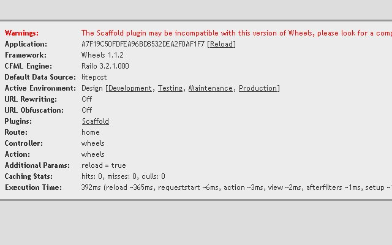

## Creating a Wheels Application

Creating a Wheels application is simple. This section will cover
requirements, installation, connecting a database, and generating code
for a starting point.

### Wheels Requirements

Wheels runs on Adobe ColdFusion 8.01/9 and Railo 3.1.2.020. The ORM
requires SQL Server 7, Oracle 10g, PostgreSQL, H2, or MySQL 5.
Additionally, it supports more recent versions of these database
management systems.

### Wheels Installation

Download the most recent Wheels release at http://cfwheels.org/download.
Next unzip into your web root.

Here are some important folders you should see in your web root.

**Folder**
**Purpose**
config
Make all your configuration changes here*
controllers
Where your CFC controllers go
models
Where your CFC models go plugins
Where any plugin zip files will go
views
Your cfm views go inside a sub-folder matching the controller name
wheels
The framework

*The config folder may seem out of place with Wheels emphasis on
convention over configuration. "Configuration files are still important
for the cases where convention fails." from
http://softwareengineering.vazexqi.com/files/pattern.html In other
words, Wheels can assume conventions but if you need to change them to
something extraordinary you can in the config folder.
 
Wheels has several other options to get started besides the process
shown above.

- Fusegrid provides an unzip and go build with Wheels, Railo, Jetty,
  and SQLite http://github.com/Fusegrid/fusegrid-sdk

- Alurium Hosting has a free 15 day trial account. The account will
  come with Railo, MySQL, and Wheels. http://alurium.com

- MARC has MySQL, Apache, Railo, and ColdFusion on Wheels with
  CFEclipse and other tools. Fire it up with VirtualBox and you can
  start coding. http://www.henke.ws/page.cfm/cfwheels/downloads

### Hello Wheels

To test our installation, lets load the site. For me, it was
http://localhost/. It is that simple. Next section we will connect a
database connection.

### Connecting a Database

Please create a database and run the SQL script from
https://github.com/mhenke/LitePostWheels/blob/master/files/litePostDB_data.sql
. This file is MySQL specific so you may have to modify it for your
database system. Next create a ColdFusion datasource called litepost in
the ColdFusion administration for our Wheels application.

Wheels assumes our datasource name will be the folder name our
application resides in. To override the Wheels datasource name
convention, modify /config/settings.cfm by adding:
 
<cfset set(dataSourceName="litepost") />

In the Wheels debugging section on the Congratulations page, notice what
the Default Data Source. Now reload Wheels by adding ?reload=true to the
end of the URL or in the Wheels debugging section click [Reload]. Check
the Default Data Source now, and you will see it changed to litepost,
what we explicitly told Wheels to use. Next we'll generate some Wheels
code.

### Getting Up and Running Quickly With scaffolding

Wheels plugins extend or modify the behavior of Wheels. Wheels has many
developer built plugins. When creating a Wheels applications, you don't
need to use any Wheels plugins but for this guide you will use one. You
will use a scaffolding plugin to generate your model, views, and
controller. This will create very basic CRUD (create, read, update, and
delete). It was developed by Raul Riera.
http://cfwheels.org/user/profile/3 Download the scaffolding plugin from
http://cfwheels.org/plugins/listing/9 and place the zip in your plugins
folder. Notice, we didn't unzip it, we only placed the zip in the
plugins folder under the web root.

We will need to do another reload so Wheels recognizes the added plugin.

Our Default Data Source field shows litepost and the Plugins field now
has a Scaffold link present. If you received an incompatible warning,
please disregard. We have the scaffolding plugin installed so lets
generate some code.

#### Creating the Model, View, and Controller

Now you have the scaffolding plugin loaded, click on the Scaffold link.
Fill in the Object name field with Entry, make sure "Model, View, and
Controller" is select for the Type field. Default should be selected for
the Template field. Click Generate. The scaffolding plugin will build
six files for you. Here is a breakdown:

**File**
**Purpose**
/controllers/Entries.cfc
The Entries controller
/models/Entry.cfc
The Entry model
/views/entries/edit.cfm
A view to edit an existing entry
/views/entries/index.cfm
A view to list all the entries
/views/entries/new.cfm
A view to create a new entry
/views/entries/show.cfm
A view to show a single entry

 The scaffolding plugin does generate some duplicate code, so in a
subsequent article we will discuss DRYing the scaffold generated code.
"Duplication in this case is more important than DRY. These templates
are bare-bone CRUD...The temtplates are the exact same as Rails (back
then I don't know how they handle scaffolding now). The simpler the
better, it is easier to "grasp" them." ~ Raul Riera
 
 With our application generated, let's step back and review how Wheels
will be handling requests and mapping the request to code along with a
couple other concepts.

### Wheels Concepts

We generated our Blog Entry application but the default page, index.cfm,
loads the Wheels Congratulations page. We will modify the default route
so when you load the site we go to the Listing entries page. First, I
would like to cover some higher level concepts with how Wheel's handles
mapping requests to code. We will start with the term Route.

#### Routes

Routes are entries in /config/routes.cfm telling Wheels how to match
incoming HTTP requests to our application's code. Routes help create
custom URLs if you want to break the general Wheels URL convention.

#### Incoming Request

Wheels has three types of incoming requests depending on how your URL
rewriting web server is setup:

 
- On - http://localhost/[controller]/[action]/[key]
- Partial- http://localhost/index.cfm/[controller]/[action]/[key]
- Off -
  http://localhost/index.cfm?controller=[controller]&action=[action]&key=[key]

As you see Wheels incoming requests follow a URL convention.

#### URL Convention

Wheels has a URL convention like other frameworks. Frameworks usually
help map the HTTP request to the code. The Wheels URL convention is to
take the request and match it to the /[controller]/[action]/[key]
pattern. Again the [controller] accepts input and decides what to get,
do, and display. The [action] is a term for a method or function in the
controller. The URLl parameters are placed in the params structure.

#### Params

You will encounter the params structure in the next section when we
review the generated code. The params structure is an important variable
in Wheels. Params combines the URL and FORM scope. You can access params
in the controller and views.
 
 "The params variable is thread safe because it is created by a
dispatcher request. When the dispatcher creates the controller to handle
the request, it initializes the controller by passing in the params
variables. If you look at the $request() method in the
/wheels/dispatch/request.cfm at this line: 
 
loc.controller = $controller(loc.params.controller);
$createControllerObject(loc.params);

That's the part where the params get passed in." ~ Tony Petruzzi,
Wheels Core Team member http://cfwheels.org/user/profile/5

The last three concepts have to do with built in Wheels functions.

#### Wheels Form Helpers

You have seen Wheels has many form helpers to make creating forms
easier. Wheels form conventions will help you spend less time writing
repetitive markup to display forms and error messages. Wheels will tie
your forms together with your model elegantly with the markup built in a
consistent manner.

#### Wheels Flash

Wheels flash is not Adobe Flash as you may have thought. Wheels flash is
a structure added to the SESSION scope and cleared on the end of the
next request. It is used to store messages or variables from one request
to another. It is mainly used for redirects but can be used during
rendering a page.

#### Using set()

Set is used for global settings before for setting our datasource. We
will use set() for setting our application's home page route. Set() can
also be used for setting defaults on functions. We'll show an example of
this when we style our user interface.

### Setting the Application Home Page

We covered Wheels concepts to better understand what we are doing when
we change the default route for our Wheels application.
 
In /config/routes.cfm, replace the catch all route with this:

 <cfset addRoute(name="home", pattern="", controller="Entries",
action="index")>

addRoute() adds a new route to your Wheels application. You are telling
Wheels to name the new route home. For any URL request matching this
route's pattern, the request will be sent to the index action of the
entries controller.

Refresh your page (for me http://localhost) and you should see the
Listing entries page. Notice in the Wheels debugging section, the Route
field displays home, and the Controller field displays Entries and the
Action field displays index.
### Creating Entries

Let's start creating some blog entries. You have functioning CRUD
created by the scaffolding plugin. Click New entry and you can create a
new entry. Please add, edit, view, and delete some entries.

When you added, edited, and created entries, notice the URLs Wheels
builds? The URL for the edit form may look like one of these three
options depending on your URL Rewriting setting. 
 
- http://localhost/entries/edit/1
- http://localhost/index.cfm/entries/edit/1
- http://localhost/index.cfm?controller=entries&action=edit&key=1

 This example, the entries controller is instantiated and the edit
action is called. The key parameter from the URL gets put into
params.key. Then the params.key is used to retrieve the specific record.

You have created a working Wheels application generated by the
scaffolding plugin while learning more about Wheels. Next we will review
the code the scaffolding plugin generated.