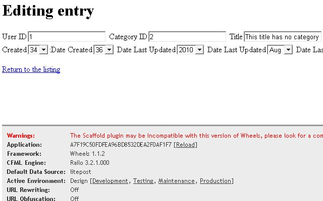

## Working with Wheels Code

introduce each section; flow; builds unto each other;
### Wheels Debugging Section

Wheels is about simplicity, so Wheels adds a straightforward Wheels
debugging section to your application. It should be located toward the
bottom of the Congratulations page. The fields to take note of are the
Default Data Source, Active Environment, and Plugins.

- Default Data Source - Wheels assumes the datasource is the folder
  name Wheels is located in. In the next section this guide will
  explain how to override itn.

- Active Environment - Wheels knows your environment based on the
  /config/environment.cfm. The file contains a simple <cfset
  set(environment="design")> statement by default. You can change
  this based on where the code is running. The set() Wheels function
  is used to configure a global default.

- Plugins - Wheels shows the Plugins field available.

 
Other helpful Wheels debugging fields are the Route, Controller, and
Action. Route shows the route used, which in this case was home.
Remember the controller accepts input, and decides what to get, do, and
display. Action is a term for a method/function in the controller.
### Adding a Link

Let's add a link toward the top of your Listing entries page. Open
/views/entries/index.cfm and add on the first line:
<cfoutput>
#linkTo(text="Home", route="home")#
</cfoutput>

linkTo() is a Wheels view helper function. The view helper functions are
called from the views and build output. Refresh your page and you should
see the new Home link. This view helper we added builds a link using the
home route. The markup built will be different depending on your URL
Rewriting setting. The html generated may look like:
- Full URL Rewriting: 
<a href="/">Home</a>

- Partial: 
<a href="/index.cfm/entries/index">Home</a>

- URL Rewriting Off: 
<a
  href="/index.cfm?controller=entries&action=index">Home</a>

Compare with the last linkTo() at the bottom of the page:

#linkTo(text="New entry", action="new")#

This linkTo() builds a link to the new action. The markup looks like
this 
<a href="/entries/new">New entry</a>
 if you have URL
rewriting on.

### Customizing our Application

INTRODUCTION

#### Layouts

A Wheels layout is used instead of creating individual header and footer
files. You use layout templates as a wrapper around your view output.
Open /views/layout.cfm and add this below the <body> tag:
<cfoutput>#flash("error")#</cfoutput>

The flash() functions gets the value of a specific key in the Wheels
flash. In the /views/layout.cfm you will also notice the
contentForLayout() Wheels helper function. It is used inside this layout
file to display the content of a view. Let's test editing a non-existing
record and see what happens.

Depending on your URL rewriting, the URL to test a non-existing entry
should be one of these:

- http://localhost/entries/edit/9999
- http://localhost/index.cfm/entries/edit/9999
- http://localhost/index.cfm?controller=entries&action=edit&key=9999

Unless you were very busy adding entries, this entry should not exist.
Wheels will try to find the entry and since it doesn't exist, will
redirect you to the Show entries page with the Wheels flash message.

 If you refresh the page, the Wheels flash message will disappear.

TRANSITION
#### Styling Forms

You may noticed the scaffolding plugin generated views aren't pretty. As
Raul mentioned about the scaffolding plugin, simpler is better for users
to understand what the code is doing. This section will demonstrate
overriding a form helpers generate output in one location instead of
individually on each form helper.

Add to /config/settings.cfml as follows to improve the form look a
little:

<cfset set(functionName="textField", labelPlacement="before",
appendToLabel=" ", prependToLabel="
", append="
")>

This code will override the textField() form helper defaults and make
ours forms look a little nicer. The textField() will be discussed more
in the "Wheels Form Helper" section. If you are curious about the
arguments passed in, please check out the textField() function
documentation.
[http://cfwheels.org/docs/function/textField](http://cfwheels.org/docs/function/textField)
Wheels has excellent documentation.

Be sure to reload your Wheels application to see the difference in a
form like the Editing entry page. Now the markup for textField() will
build:

<label for="yourInput ">Your Label</label> 

<input id="yourInput" name="yourInput" type="text" value="">

Before

After

 
### The Model

The model, /models/Entry.cfc, is currently very simple.

<cfcomponent extends="Model" output="false">

<cffunction name="init">
</cffunction>

</cfcomponent>

Models in Wheels use a singular name, and their corresponding table uses
a plural name. This can be overrode with a simple <cfset
table("tbl_Entry")> in the init function of the model cfc. With this
example, the table name in the database would be tbl_Entry instead of
Entries.

 ---------
 Side note:
"Wheels adopts a Rails-style naming conventions for database tables and
model files. Think of a database table as a collection of model objects;
therefore, it is named with a plural name. Think of a model object as a
representation of a single record from the database table; therefore, it
is named with a singular word." from
http://cfwheels.org/docs/chapter/conventions
---------

#### Adding Some Validation

Wheels has built in functions to help validate data sent to the model.
Open /models/Entry.cfc and edit the init function as follows:

<cfset validatesPresenceOf("userid,title,body")>
<cfset validatesLengthOf(properties="title", minimum=5, message="Please
make your [property] 5 characters or more.", allowblank=true)>

 These changes ensure all entries have a userid, title, and body, and
the length of title is at least five characters. Wheels has a variety of
methods to enforce data constraints.

Notice, you added allowblank=true for validatesLenghtOf(). This helps to
stop double error messages for the title property. Now if title is
submitted as blank, the form displays "Title can't be blank". If title
is less then five characters, the error message displays "Please make
your title 5 characters or more". The form doesn't display both error
messages since validateLengthOf() allows blanks. [property] will display
the title property name in the error message for validatesLengthOf().

You might be wondering how Wheels is displaying the model's error
messages. It is actually a errorMessagesFor() Wheels form helper in the
view we discussed earlier.

On the Edit entry view, the markup built looks like this on an error if
you hit our trifecta of validation we created:

<ul class="error-messages">
<li>Userid can't be empty</li>
<li>Body can't be empty</li>
<li>Please make your title 5 characters or more.</li>
</ul>

If you leave the userid field blank, put a value in title, and submit
the form, the textField() helper actually builds this:

 
<label for="entry-userID">User I D
<input id="entry-userID" name="entry[userID]" type="text" value="">
</label>

 
With some simple CSS, you could spruce it up like having a red border
around the inputs with a field-with-errors class defined in your css.
Also notice the title field is still populated with the value you
entered.

#### Model Class Functions

When you create a model in Wheels, classes are created for interacting
with the table. Remember each CFC in the models folder represents a
table in your database. There are three read model class functions
created on a model object in Wheels: findAll(), findByKey(), and
findOne().
 
 findAll() will return records from the database. The records will be
returned as a cfquery result by convention. findByKey() and findOne()
returns a record from the database. The record will be returned as an
object by convention. As with most Wheels conventions, if you find an
extraordinary situation you can override the convention easily.
 
Here is the dump of entries variable from the Listing entries page
(/view/entries/index.cfm). The index action uses a findAll() to create
the entries variable in /controllers/Entries.cfc. Add <cfdump
var="#entries#"><cfabort> to the file if you want to follow along.

 Here is the dump of entry variable from the show entry page
(/view/entries/show.cfm). The show action uses a findFindBy() to create
the entry variable in /controllers/Entries.cfc. The properties/columns
are placed in the THIS scope of the entry model object, see the body
property in figure XX. Add <cfdump var="#entry#"><cfabort> to the
file if you want to follow along.

 Be sure to remove the cfdump and cfaborts from your code if you added
them.

### NOT SURE WHATS

Open /controllers/Entries.cfc and scan the code for the edit action.

<cffunction name="edit">
<!--- Find the record --->
<cfset entry = model("Entry").findByKey(params.key)>
<!--- Check if the record exists --->
<cfif NOT IsObject(entry)>
<cfset flashInsert(error="Entry #params.key# was not found")>
<cfset redirectTo(action="index")>
</cfif>
</cffunction>

 The findByKey() has params.key passed in from the URL to retrieve a
specific entry. findByKey() is smart enough to figure out the entries
table's primary key is entryid. It will use the params.key and find the
matching primary key record. You can see if the entry variable isn't an
object, a Wheels flash message is inserted into the Wheels flash. Then
the index view will be redirected. You will see how to display the
Wheels flash in the next section.