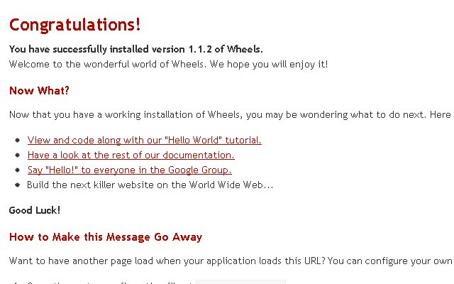
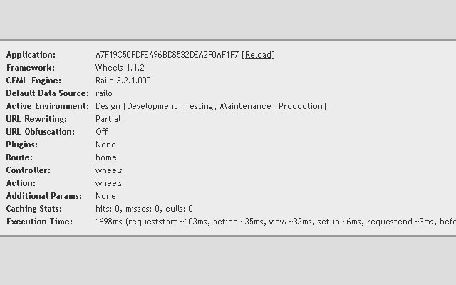
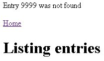
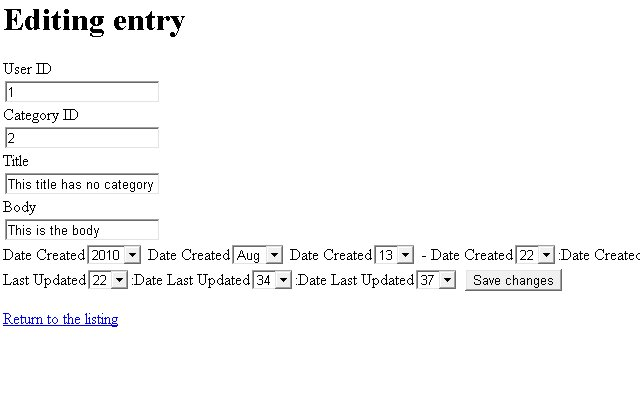
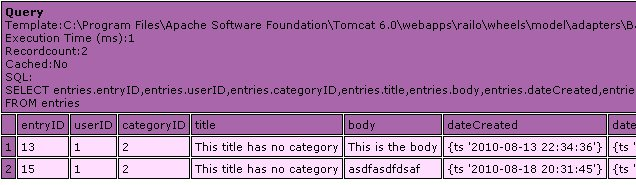
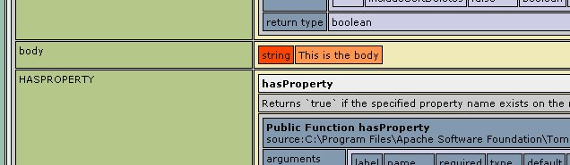

# *Wheels Getting Started*

*TODO: add about var scoping -
http://groups.google.com/group/cfwheels/browse_thread/thread/4b72e10b53507fc0/dc89453f1c3e2622?lnk=gst&q=var+scoping#dc89453f1c3e2622*
 
 In this article Mike Henke will discuss ColdFusion On Wheels (Wheels).
Wheels is a ColdFusion framework inspired by Ruby On Rails. Wheels is
simple to use with the convention over configuration aspect. Wheels
doesn't turn using a ColdFusion framework into something different then
how you originally learned to code CFML. It is the only framework with
an integrated Object Relational Mapper to make interacting with your
database even simpler.

This article will be divided into four sections. The first section,
"What is Wheels?", is an introduction into Wheels philosophies like
simpilicty and convention over configuration. The second section,
"Creating a Wheels application", will show how to get up and running
with Wheels. We will also generate a simple application with a
scaffolding plugin. The third section, "Reviewing Generated Code", will
walk through the generated code. The fourth section, "Working with
Wheels", will customizing our application and add some functionality.
## *What is Wheels?*

Wheels is a ColdFusion framework using object oriented processes while
not forcing you to know oo. It does this by guiding you into writing
more maintainable and reusable code. Wheels is not a direct port of Ruby
on Rails (RoR).

### Wheels Philosophies

Wheels philosophies include:

Simplicity
- Full Stack
- Object Relational Mapping

Convention Over Configuration
Model-View-Controller
Object Relational Mapping

#### Simplicity

The simplicity of Wheels is a major reason I have become a fan. The
simplicity derives from convention over configuration. You follow the
conventions and you are golden. If you need to override a convention,
you can. The model objects have no getters or setters, another
simplicity feature. The properties are attached to the object in the
THIS scope. To get a column you would use #myModelObject.myColumn#.
There are no XML configuration files which keeps Wheels simple. One
simplicity feature is Wheels is one cohesive solution called a "Full
Stack" framework.

##### Full Stack

"Full stack" incorporates multiple features for developers into one
cohesive, fully functional solution. Per Djumner
http://cfwheels.org/user/profile/2, former lead developer for Wheels,
describes this as Wheels is "meant to be used without needing any other
frameworks. Compared with other ColdFusion frameworks where it's more
expected the developer will use some other framework" like Transfer for
Object Relation Mapping and ColdSpring for Inversion of control (IoC).
Wheels "full stack" includes validation, caching, and an Object
Relational Mapping solution.

##### Object Relational Mapping

The Object Relational Mapping (ORM) in Wheels will reduce the need to
create repetitive, basic SQL statements. Wheels implements the Active
Record design pattern to accomplish this. One detail of Active Record is
the database defines your model objects. Your model object will have
classes to interact with the data. With Active Record, encapsulation
occurs by hiding the SQL statement but not the data structure.

 You may have heard a lot about ORMs recently with Adobe ColdFusion 9
integrating Hibernate. The problem an ORM is trying to solve is
converting two incompatible data types: your relational database and
object-oriented code. Think of squares trying to fit into circles. The
ORM solves this problem. Hibernate takes a slightly different approach
from Wheels. Hiberate uses the Data Mapper design pattern. For more
information on different approaches to access data, readAdobe ColdFusion
Anthology Chapter 21 "Beans and DAOs and Gateways, Oh My!" by Sean
Corfield.

#### Convention Over Configuration

Sensible defaults are important to Wheels. I use sensible defaults and
convention over configuration (CoC) interchangeably. CoC is a software
design idea. CoC allows the developer to focus on coding instead of
worrying about for mapping between a functions, a databases and URL
requests. The developer only needs to configure the extraordinary, not
the ordinary. CoC decreases the number of decisions, while increasing
simplicity and maintaining flexibility.

I describe CoC with this story. In the mornings, I have a bacon, egg,
and cheese croissant sandwich with a coffee. I walk into the cafe and
when the cook sees me, we nod at each other. I grab my coffee and at the
cash register, my sandwich is waiting for me. We are using CoC. The cook
assumes I want my ordinary order, if I wanted something extraordinary I
would have to say so. Some conventions are based on how Wheels is
orgainized using the Model-View-Controller (MVC) architecture.

#### Model-View-Controller

MVC architecture purpose is organizing your code and promoting
simplicity. It should be clear where different types of code belong. In
Wheels, the file and folder structure should be very intuitive. Models
go in the models folder, Views go in the views folder and so on. Another
goal of MVC is promoting DRY (Don't Repeat Yourself) code.

Here is a simple explanation for each piece of MVC.

##### Model

The model is the data. In Wheels, a CFC in the models folder represents
a table in your database.

##### View

The view is what is presented to the user. It could be HTML, XML, JSON,
or other forms of content. In Wheels, the views will be a cfm file.

##### Controller

The controller is the brains of your Wheels application. It tells the
application what to get, what to do with it, and how to give it to the
user. In Wheels, the controller will be a CFC located in the controllers
folder.

As you read, Wheels borrows philosophies from RoR and implements them
in ColdFusion friendly, simple ways. Wheels coding and flow should not
be much different then when you first learned CFML from Ben Forta's
books. Wheels will guides you to better, more maintainable code. Let's
create a Wheels applications.

## Creating a Wheels Application

Creating a Wheels application is simple. This section will cover
requirements, installation, connecting a database, and generating code
for a starting point.

### Wheels Requirements

Wheels runs on Adobe ColdFusion 8.01/9 and Railo 3.1.2.020. The ORM
requires SQL Server 7, Oracle 10g, PostgreSQL, H2, or MySQL 5.
Additionally, it supports more recent versions of these database
management systems.

### Wheels Installation

Download the most recent Wheels release at http://cfwheels.org/download.
Next unzip into your web root.

Here are some important folders you should see in your web root.

**Folder**
**Purpose**
config
Make all your configuration changes here*
controllers
Where your CFC controllers go
models
Where your CFC models go plugins
Where any plugin zip files will go
views
Your cfm views go inside a sub-folder matching the controller name
wheels
The framework

*The config folder may seem out of place with Wheels emphasis on
convention over configuration. "Configuration files are still important
for the cases where convention fails." from
http://softwareengineering.vazexqi.com/files/pattern.html In other
words, Wheels can assume conventions but if you need to change them to
something extraordinary you can in the config folder.
 
Wheels has several other options to get started besides the process
shown above.

- Fusegrid provides an unzip and go build with Wheels, Railo, Jetty,
  and SQLite http://github.com/Fusegrid/fusegrid-sdk

- Alurium Hosting has a free 15 day trial account. The account will
  come with Railo, MySQL, and Wheels. http://alurium.com

- MARC has MySQL, Apache, Railo, and ColdFusion on Wheels with
  CFEclipse and other tools. Fire it up with VirtualBox and you can
  start coding. http://www.henke.ws/page.cfm/cfwheels/downloads

### Hello Wheels

To test our installation, lets load the site. For me, it was
http://localhost/. It is that simple. Next section we will connect a
database connection.

### Connecting a Database

Please create a database and run the SQL script from
https://github.com/mhenke/LitePostWheels/blob/master/files/litePostDB_data.sql
. This file is MySQL specific so you may have to modify it for your
database system. Next create a ColdFusion datasource called litepost in
the ColdFusion administration for our Wheels application.

Wheels assumes our datasource name will be the folder name our
application resides in. To override the Wheels datasource name
convention, modify /config/settings.cfm by adding:
 
<cfset set(dataSourceName="litepost") />

In the Wheels debugging section on the Congratulations page, notice what
the Default Data Source. Now reload Wheels by adding ?reload=true to the
end of the URL or in the Wheels debugging section click [Reload]. Check
the Default Data Source now, and you will see it changed to litepost,
what we explicitly told Wheels to use. Next we'll generate some Wheels
code.

### Getting Up and Running Quickly With scaffolding

Wheels plugins extend or modify the behavior of Wheels. Wheels has many
developer built plugins. When creating a Wheels applications, you don't
need to use any Wheels plugins but for this guide you will use one. You
will use a scaffolding plugin to generate your model, views, and
controller. This will create very basic CRUD (create, read, update, and
delete). It was developed by Raul Riera.
http://cfwheels.org/user/profile/3 Download the scaffolding plugin from
http://cfwheels.org/plugins/listing/9 and place the zip in your plugins
folder. Notice, we didn't unzip it, we only placed the zip in the
plugins folder under the web root.

We will need to do another reload so Wheels recognizes the added plugin.

Our Default Data Source field shows litepost and the Plugins field now
has a Scaffold link present. If you received an incompatible warning,
please disregard. We have the scaffolding plugin installed so lets
generate some code.

#### Creating the Model, View, and Controller

Now you have the scaffolding plugin loaded, click on the Scaffold link.
Fill in the Object name field with Entry, make sure "Model, View, and
Controller" is select for the Type field. Default should be selected for
the Template field. Click Generate. The scaffolding plugin will build
six files for you. Here is a breakdown:

**File**
**Purpose**
/controllers/Entries.cfc
The Entries controller
/models/Entry.cfc
The Entry model
/views/entries/edit.cfm
A view to edit an existing entry
/views/entries/index.cfm
A view to list all the entries
/views/entries/new.cfm
A view to create a new entry
/views/entries/show.cfm
A view to show a single entry

 The scaffolding plugin does generate some duplicate code, so in a
subsequent article we will discuss DRYing the scaffold generated code.
"Duplication in this case is more important than DRY. These templates
are bare-bone CRUD...The temtplates are the exact same as Rails (back
then I don't know how they handle scaffolding now). The simpler the
better, it is easier to "grasp" them." ~ Raul Riera
 
 With our application generated, let's step back and review how Wheels
will be handling requests and mapping the request to code along with a
couple other concepts.

### Wheels Concepts

We generated our Blog Entry application but the default page, index.cfm,
loads the Wheels Congratulations page. We will modify the default route
so when you load the site we go to the Listing entries page. First, I
would like to cover some higher level concepts with how Wheel's handles
mapping requests to code. We will start with the term Route.

#### Routes

Routes are entries in /config/routes.cfm telling Wheels how to match
incoming HTTP requests to our application's code. Routes help create
custom URLs if you want to break the general Wheels URL convention.

#### Incoming Request

Wheels has three types of incoming requests depending on how your URL
rewriting web server is setup:

 
- On - http://localhost/[controller]/[action]/[key]
- Partial- http://localhost/index.cfm/[controller]/[action]/[key]
- Off -
  http://localhost/index.cfm?controller=[controller]&action=[action]&key=[key]

As you see Wheels incoming requests follow a URL convention.

#### URL Convention

Wheels has a URL convention like other frameworks. Frameworks usually
help map the HTTP request to the code. The Wheels URL convention is to
take the request and match it to the /[controller]/[action]/[key]
pattern. Again the [controller] accepts input and decides what to get,
do, and display. The [action] is a term for a method or function in the
controller. The URLl parameters are placed in the params structure.

#### Params

You will encounter the params structure in the next section when we
review the generated code. The params structure is an important variable
in Wheels. Params combines the URL and FORM scope. You can access params
in the controller and views.
 
 "The params variable is thread safe because it is created by a
dispatcher request. When the dispatcher creates the controller to handle
the request, it initializes the controller by passing in the params
variables. If you look at the $request() method in the
/wheels/dispatch/request.cfm at this line: 
 
loc.controller = $controller(loc.params.controller);
$createControllerObject(loc.params);

That's the part where the params get passed in." ~ Tony Petruzzi,
Wheels Core Team member http://cfwheels.org/user/profile/5

The last three concepts have to do with built in Wheels functions.

#### Wheels Form Helpers

You have seen Wheels has many form helpers to make creating forms
easier. Wheels form conventions will help you spend less time writing
repetitive markup to display forms and error messages. Wheels will tie
your forms together with your model elegantly with the markup built in a
consistent manner.

#### Wheels Flash

Wheels flash is not Adobe Flash as you may have thought. Wheels flash is
a structure added to the SESSION scope and cleared on the end of the
next request. It is used to store messages or variables from one request
to another. It is mainly used for redirects but can be used during
rendering a page.

#### Using set()

Set is used for global settings before for setting our datasource. We
will use set() for setting our application's home page route. Set() can
also be used for setting defaults on functions. We'll show an example of
this when we style our user interface.

### Setting the Application Home Page

We covered Wheels concepts to better understand what we are doing when
we change the default route for our Wheels application.
 
In /config/routes.cfm, replace the catch all route with this:

 <cfset addRoute(name="home", pattern="", controller="Entries",
action="index")>

addRoute() adds a new route to your Wheels application. You are telling
Wheels to name the new route home. For any URL request matching this
route's pattern, the request will be sent to the index action of the
entries controller.

Refresh your page (for me http://localhost) and you should see the
Listing entries page. Notice in the Wheels debugging section, the Route
field displays home, and the Controller field displays Entries and the
Action field displays index.
### Creating Entries

Let's start creating some blog entries. You have functioning CRUD
created by the scaffolding plugin. Click New entry and you can create a
new entry. Please add, edit, view, and delete some entries.

When you added, edited, and created entries, notice the URLs Wheels
builds? The URL for the edit form may look like one of these three
options depending on your URL Rewriting setting. 
 
- http://localhost/entries/edit/1
- http://localhost/index.cfm/entries/edit/1
- http://localhost/index.cfm?controller=entries&action=edit&key=1

 This example, the entries controller is instantiated and the edit
action is called. The key parameter from the URL gets put into
params.key. Then the params.key is used to retrieve the specific record.

You have created a working Wheels application generated by the
scaffolding plugin while learning more about Wheels. Next we will review
the code the scaffolding plugin generated.

## Reviewing Generated Code

We have installed Wheels and created a simple application for blog
entries. This next several sections of the article will show, review,
and explain Wheels code generated by the scaffolding plugin. We will
look at the Listing, Create, Show, Edit, and Delete functionality.

### Listing entries

We will start by looking at the functionality listing all the entries.
Open /controllers/entries.cfc and look at the index action:
 
<cffunction name="index">
<cfset entries = model("Entry").findAll()>
</cffunction>

 This code returns all records from the entries table. It uses the built
in Wheels ORM. Entry is our table name. model() is a Wheels ORM function
and findAll() is a Wheels Model class.

If you browse to the Listing entries page, you can see listing the
entries in work. Wheels makes the VARIABLES scope available from the
controller's action to the view. The view being displayed corresponds to
the action's name.

Notice the view is rendered by convention. The index action didn't have
to say render /views/entries/index.cfm.

Here's /views/entries/index.cfm:

<cfoutput>
#linkTo(text="Home", route="home")#
</cfoutput>

<h1>Listing entries</h1>

<cftable query="entries" colHeaders="true" HTMLTable="true">
<cfcol header="Entry I D" text="#entryID#" />
<cfcol header="User I D" text="#userID#" />
<cfcol header="Category I D" text="#categoryID#" />
<cfcol header="Title" text="#title#" />
<cfcol header="Body" text="#body#" />
<cfcol header="Date Created" text="#dateCreated#" />
<cfcol header="Date Last Updated" text="#dateLastUpdated#" />
<cfcol header="" text="#linkTo(text='Show', action='show',
key=entryID)#" />
<cfcol header="" text="#linkTo(text='Edit', action='edit',
key=entryID)#" />
<cfcol header="" text="#linkTo(text='Delete', action='delete',
key=entryID, confirm='Are you sure?')#" />
</cftable>

<cfoutput>

#linkTo(text="New entry", action="new")#

</cfoutput>

 This view is using the entries variable set in index action of the
entries controller. The index view shows the content and some links. The
second linkTo() builds a Show link to the show action and passes in a
key. It builds this markup <a href="/entries/show/15">Show</a> if you
have URL Rewriting On. The fourth linkTo() displays Delete, pops a
javascript alert to confirm you want to continue, and if yes passes a
key to the delete action. The Delete linkTo() builds this HTML and
javascript as <a href="/entries/delete/15" onclick="return confirm('Are
you sure?');">.

### Creating New Entry

Creating a new entry consists of two actions. The first is the new
action which instantiates an empty entry object. The second action is to
create an entry via the create action.

#### Action One, Display New page

<cffunction name="new">
<cfset entry = model("Entry").new()>
</cffunction>

The next section we will break down the new entry view. The code may
look intimidating. You don't have to use Wheels helper functions but
hopefully after the explanation you will want to since helpers do just
that - help.

 The /views/entry/new.cfm displays this empty entry to you:

<h1>Create new entry</h1>

<cfoutput>

#errorMessagesFor("entry")#
#startFormTag(action="create")#
#textField(objectName='entry', property='userID', label='User I D')#
#textField(objectName='entry', property='categoryID', label='Category I
D')#
#textField(objectName='entry', property='title', label='Title')#
#textField(objectName='entry', property='body', label='Body')#
#dateTimeSelect(objectName='entry', property='dateCreated',
dateOrder='year,month,day', monthDisplay='abbreviations', label='Date
Created')#
#dateTimeSelect(objectName='entry', property='dateLastUpdated',
dateOrder='year,month,day', monthDisplay='abbreviations', label='Date
Last Updated')#

#submitTag()#
#endFormTag()#

#linkTo(text="Return to the listing", action="index")#
</cfoutput>

Let's begin with errorMessageFor() in /views/entry/new.cfm. It builds
and returns a list containing all the error messages for the Entry model
based on your validation in the model.

Next is the startFormTag() form helper. It builds the starting form tag
and maps it to the create action. The markup created is <form
action="/entries/create" method="post">.
 
The textField() creates a text field populated by the userid property.
The markup it creates is:

<label for="entry-userID">User I D
<input id="entry-userID" name="entry[userID]" type="text" value="" />
</label>

Wheels form helpers may look a little different then you are use to for
creating forms, but hopefully now you understand how they tie your model
into your form. Wheels form helpers are there to help you be more
productive and produce more consistent markup.

#### Action Two, Create New Entry

Finally for the Create new entry, when you click on the submit button,
the browser sends the form information to the create action in the entry
controller.

<cffunction name="create">
<cfset entry = model("Entry").new(params.entry)>
<!--- Verify that the entry creates successfully --->
<cfif entry.save()>
<cfset flashInsert(success="The entry was created successfully.")>
<cfset redirectTo(action="index")>
<!--- Otherwise --->
<cfelse>
<cfset flashInsert(error="There was an error creating the entry.")>
<cfset renderPage(action="new")>
</cfif>
</cffunction>

In the create action, first new() creates a new object based on
params.entry. The params.entry argument passed into new() is the new
form values. The cfif saves the entry object and if successful inserts a
Wheels flash message then redirects to the index action. If not
successful, a Wheels flash message is inserted then the new view is
rendered.

### Showing an Individual Entry

When you click on the show link for an entry from the Listings entries
page, it calls the show action and passes in a key.

 Your show entry URL may look similiar to one of these:

- http://localhost/entries/show/1
- http://localhost/index.cfm/entries/show/1
- http://localhost/index.cfm?controller=entries&show=edit&key=1

Here is the show action in /controllers/entries.cfc:

<cffunction name="show">
<!--- Find the record --->
<cfset entry = model("Entry").findByKey(params.key)>
<!--- Check if the record exists --->
<cfif NOT IsObject(entry)>
<cfset flashInsert(error="Entry #params.key# was not found")>
<cfset redirectTo(action="index")>
</cfif>
</cffunction>

 The show action uses findByKey() to query for the record by the
params.key. If the entry isn't found, the user is directed the Listing
entry page with an message. The entry variable is passed to the
/views/entries/show.cfm since it is in the VARIABLES scope. Here is the
show view:
 
<h1>Showing entry</h1>

<cfoutput>

Entry I D  
#entry.entryID#

User I D  
#entry.userID#

Category I D  
#entry.categoryID#

Title  
#entry.title#

Body  
#entry.body#

Date Created  
#entry.dateCreated#

Date Last Updated  
#entry.dateLastUpdated#

#linkTo(text="Return to the listing", action="index")# |
#linkTo(text="Edit this entry", action="edit", key=entry.entryID)#
</cfoutput>

 This code displays the entry model object created in the show action.
The linkTo() form helpers are building two links. The first linkTo() is
for going back to the Listings entry page which is the index action. The
second linkTo() is for editing the entry. Notice it is passing in the
primary key for the entry as a key argument.
### Editing an Entry

Similar to creating a new entry, editing an entry is in two parts. The
first is a request to edit with a particular entry key and the second
part is to update the particular entry. "Edit this entry" link calls the
edit action in the entries controller and passes a key to it. Here is
the edit action:

<cffunction name="edit">
<!--- Find the record --->
<cfset entry = model("Entry").findByKey(params.key)>
<!--- Check if the record exists --->
<cfif NOT IsObject(entry)>
<cfset flashInsert(error="Entry #params.key# was not found")>
<cfset redirectTo(action="index")>
</cfif>
</cffunction>

After finding the requested entry, Wheels uses /views/entries/edit.cfm
to display the record. If the entry is not found, you will be redirected
the the Show entries page which you tested out in the "Customizing
Layouts" section to show the Wheels flash message.

When submitting the edit form, the update action is called.

<cffunction name="update">
<cfset entry = model("Entry").findByKey(params.key)>
<!--- Verify that the entry updates successfully --->
<cfif entry.update(params.entry)>
<cfset flashInsert(success="The entry was updated successfully.")>
<cfset redirectTo(action="index")>
<!--- Otherwise --->
<cfelse>
<cfset flashInsert(error="There was an error updating the entry.")>
<cfset renderPage(action="edit")>
</cfif>
</cffunction>

In the update action, the code looks for the specific entry matching the
params.key with the FindByKey(). The model object returned represents a
record as the entry variable. The cfif is checking if the update is
successful. The params.entry argument passed into update() is the edit
form values. They are applied during the update method call. If
successful, a redirect to the index view occurs. If unsuccessful, you
are taken to the edit view.
### Deleting an Entry

Finally, clicking a delete link calls the delete action.

<cffunction name="delete">
<cfset entry = model("Entry").findByKey(params.key)>
<!--- Verify that the entry deletes successfully --->
<cfif entry.delete()>
<cfset flashInsert(success="The entry was deleted successfully.")>
<cfset redirectTo(action="index")>
<!--- Otherwise --->
<cfelse>
<cfset flashInsert(error="There was an error deleting the entry.")>
<cfset redirectTo(action="index")>
</cfif>
</cffunction>

 The delete action removes a matching record from the database. If
successful, you are directed to the index view with a successful Wheels
flash message. If unsuccessful, you are directed to the index view with
an error Wheels flash message.

Our code review is done. Hopefully you noticed how simple Wheels
implements the action and display idea from when you originally learned
ColdFusion. Advance Wheels techniques you can start doing more code
reuse and start overriding the Wheels conventions while still keeping
your code simple and maintainable.
## Working with Wheels Code

introduce each section; flow; builds unto each other;
### Wheels Debugging Section

Wheels is about simplicity, so Wheels adds a straightforward Wheels
debugging section to your application. It should be located toward the
bottom of the Congratulations page. The fields to take note of are the
Default Data Source, Active Environment, and Plugins.

- Default Data Source - Wheels assumes the datasource is the folder
  name Wheels is located in. In the next section this guide will
  explain how to override itn.

- Active Environment - Wheels knows your environment based on the
  /config/environment.cfm. The file contains a simple <cfset
  set(environment="design")> statement by default. You can change
  this based on where the code is running. The set() Wheels function
  is used to configure a global default.

- Plugins - Wheels shows the Plugins field available.

 
Other helpful Wheels debugging fields are the Route, Controller, and
Action. Route shows the route used, which in this case was home.
Remember the controller accepts input, and decides what to get, do, and
display. Action is a term for a method/function in the controller.
### Adding a Link

Let's add a link toward the top of your Listing entries page. Open
/views/entries/index.cfm and add on the first line:
<cfoutput>
#linkTo(text="Home", route="home")#
</cfoutput>

linkTo() is a Wheels view helper function. The view helper functions are
called from the views and build output. Refresh your page and you should
see the new Home link. This view helper we added builds a link using the
home route. The markup built will be different depending on your URL
Rewriting setting. The html generated may look like:
- Full URL Rewriting: 
<a href="/">Home</a>

- Partial: 
<a href="/index.cfm/entries/index">Home</a>

- URL Rewriting Off: 
<a
  href="/index.cfm?controller=entries&action=index">Home</a>

Compare with the last linkTo() at the bottom of the page:

#linkTo(text="New entry", action="new")#

This linkTo() builds a link to the new action. The markup looks like
this 
<a href="/entries/new">New entry</a>
 if you have URL
rewriting on.

### Customizing our Application

INTRODUCTION

#### Layouts

A Wheels layout is used instead of creating individual header and footer
files. You use layout templates as a wrapper around your view output.
Open /views/layout.cfm and add this below the <body> tag:
<cfoutput>#flash("error")#</cfoutput>

The flash() functions gets the value of a specific key in the Wheels
flash. In the /views/layout.cfm you will also notice the
contentForLayout() Wheels helper function. It is used inside this layout
file to display the content of a view. Let's test editing a non-existing
record and see what happens.

Depending on your URL rewriting, the URL to test a non-existing entry
should be one of these:

- http://localhost/entries/edit/9999
- http://localhost/index.cfm/entries/edit/9999
- http://localhost/index.cfm?controller=entries&action=edit&key=9999

Unless you were very busy adding entries, this entry should not exist.
Wheels will try to find the entry and since it doesn't exist, will
redirect you to the Show entries page with the Wheels flash message.

 If you refresh the page, the Wheels flash message will disappear.

TRANSITION
#### Styling Forms

You may noticed the scaffolding plugin generated views aren't pretty. As
Raul mentioned about the scaffolding plugin, simpler is better for users
to understand what the code is doing. This section will demonstrate
overriding a form helpers generate output in one location instead of
individually on each form helper.

Add to /config/settings.cfml as follows to improve the form look a
little:

<cfset set(functionName="textField", labelPlacement="before",
appendToLabel=" ", prependToLabel="
", append="
")>

This code will override the textField() form helper defaults and make
ours forms look a little nicer. The textField() will be discussed more
in the "Wheels Form Helper" section. If you are curious about the
arguments passed in, please check out the textField() function
documentation.
[http://cfwheels.org/docs/function/textField](http://cfwheels.org/docs/function/textField)
Wheels has excellent documentation.

Be sure to reload your Wheels application to see the difference in a
form like the Editing entry page. Now the markup for textField() will
build:

<label for="yourInput ">Your Label</label> 

<input id="yourInput" name="yourInput" type="text" value="">

Before

After

 
### The Model

The model, /models/Entry.cfc, is currently very simple.

<cfcomponent extends="Model" output="false">

<cffunction name="init">
</cffunction>

</cfcomponent>

Models in Wheels use a singular name, and their corresponding table uses
a plural name. This can be overrode with a simple <cfset
table("tbl_Entry")> in the init function of the model cfc. With this
example, the table name in the database would be tbl_Entry instead of
Entries.

 ---------
 Side note:
"Wheels adopts a Rails-style naming conventions for database tables and
model files. Think of a database table as a collection of model objects;
therefore, it is named with a plural name. Think of a model object as a
representation of a single record from the database table; therefore, it
is named with a singular word." from
http://cfwheels.org/docs/chapter/conventions
---------

#### Adding Some Validation

Wheels has built in functions to help validate data sent to the model.
Open /models/Entry.cfc and edit the init function as follows:

<cfset validatesPresenceOf("userid,title,body")>
<cfset validatesLengthOf(properties="title", minimum=5, message="Please
make your [property] 5 characters or more.", allowblank=true)>

 These changes ensure all entries have a userid, title, and body, and
the length of title is at least five characters. Wheels has a variety of
methods to enforce data constraints.

Notice, you added allowblank=true for validatesLenghtOf(). This helps to
stop double error messages for the title property. Now if title is
submitted as blank, the form displays "Title can't be blank". If title
is less then five characters, the error message displays "Please make
your title 5 characters or more". The form doesn't display both error
messages since validateLengthOf() allows blanks. [property] will display
the title property name in the error message for validatesLengthOf().

You might be wondering how Wheels is displaying the model's error
messages. It is actually a errorMessagesFor() Wheels form helper in the
view we discussed earlier.

On the Edit entry view, the markup built looks like this on an error if
you hit our trifecta of validation we created:

<ul class="error-messages">
<li>Userid can't be empty</li>
<li>Body can't be empty</li>
<li>Please make your title 5 characters or more.</li>
</ul>

If you leave the userid field blank, put a value in title, and submit
the form, the textField() helper actually builds this:

 
<label for="entry-userID">User I D
<input id="entry-userID" name="entry[userID]" type="text" value="">
</label>

 
With some simple CSS, you could spruce it up like having a red border
around the inputs with a field-with-errors class defined in your css.
Also notice the title field is still populated with the value you
entered.

#### Model Class Functions

When you create a model in Wheels, classes are created for interacting
with the table. Remember each CFC in the models folder represents a
table in your database. There are three read model class functions
created on a model object in Wheels: findAll(), findByKey(), and
findOne().
 
 findAll() will return records from the database. The records will be
returned as a cfquery result by convention. findByKey() and findOne()
returns a record from the database. The record will be returned as an
object by convention. As with most Wheels conventions, if you find an
extraordinary situation you can override the convention easily.
 
Here is the dump of entries variable from the Listing entries page
(/view/entries/index.cfm). The index action uses a findAll() to create
the entries variable in /controllers/Entries.cfc. Add <cfdump
var="#entries#"><cfabort> to the file if you want to follow along.

 Here is the dump of entry variable from the show entry page
(/view/entries/show.cfm). The show action uses a findFindBy() to create
the entry variable in /controllers/Entries.cfc. The properties/columns
are placed in the THIS scope of the entry model object, see the body
property in figure XX. Add <cfdump var="#entry#"><cfabort> to the
file if you want to follow along.

 Be sure to remove the cfdump and cfaborts from your code if you added
them.

### NOT SURE WHATS

Open /controllers/Entries.cfc and scan the code for the edit action.

<cffunction name="edit">
<!--- Find the record --->
<cfset entry = model("Entry").findByKey(params.key)>
<!--- Check if the record exists --->
<cfif NOT IsObject(entry)>
<cfset flashInsert(error="Entry #params.key# was not found")>
<cfset redirectTo(action="index")>
</cfif>
</cffunction>

 The findByKey() has params.key passed in from the URL to retrieve a
specific entry. findByKey() is smart enough to figure out the entries
table's primary key is entryid. It will use the params.key and find the
matching primary key record. You can see if the entry variable isn't an
object, a Wheels flash message is inserted into the Wheels flash. Then
the index view will be redirected. You will see how to display the
Wheels flash in the next section.
## **What's Next?**

First congratulations! Please pat yourself on your back, you created
your first Wheels application. You can fix it up even more and
experiment. Also, you can look at the Litepost sample application since
you have the tables setup. Litepost is meant to compare different
frameworks using the same code base. Wheels is about community and
helping each other so say Hi on the CFWheels Google Group.

Wheels Documentation http://cfwheels.org/docs
CFWheels Google Group http://groups.google.com/group/cfwheels
Wheels Screencasts http://cfwheels.org/screencasts
LitePost http://github.com/mhenke/litepost
## License and Acknowledgments

This work is licensed under a Creative Commons Attribution-Share Alike
3.0 License. http://creativecommons.org/licenses/by-sa/3.0/ This adapted
article was originally published in the Fusion Authority Quarterly
Update. Any questions or comments regarding this guide can be posted at
the CFWheels Google group http://groups.google.com/group/cfwheels

